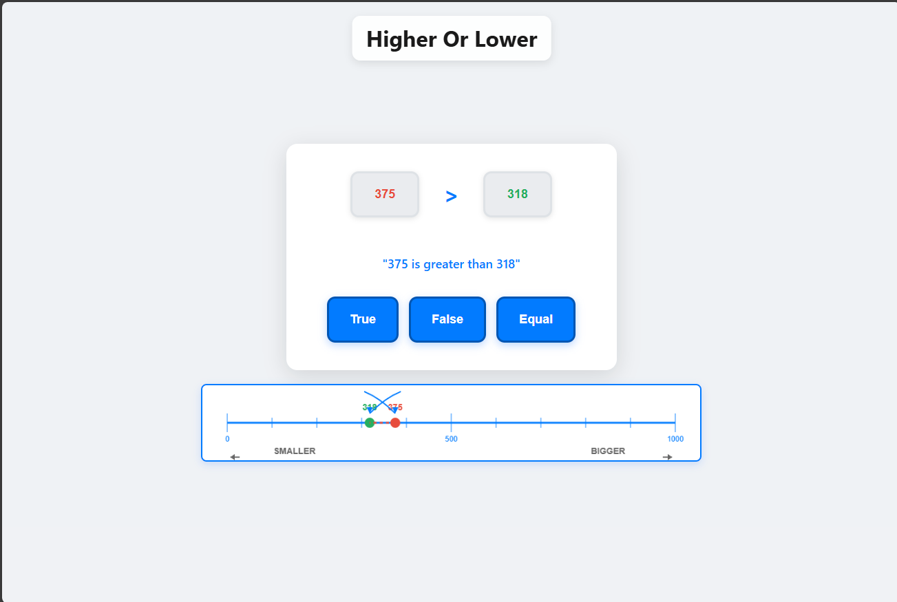
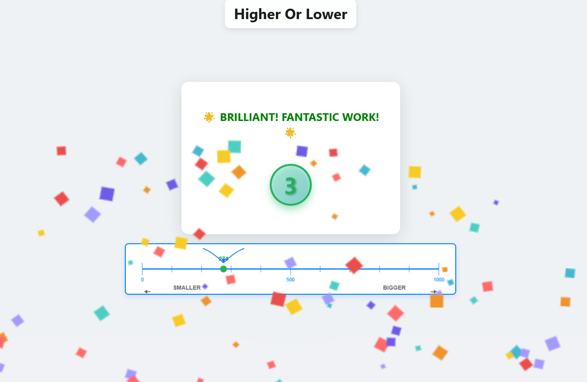
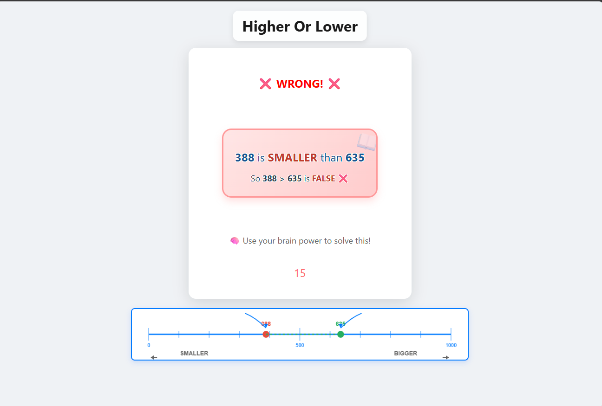

# 🎮 Higher Or Lower - Teaching My 6-Year-Old Math with Code

## The Story

About 20 minutes ago I wrapped up a little experiment with Claude Code and my 6 year old kiddo.

I used the WebStorm HTML5Boilerplate template, which comes with Webpack + Hot Module Reloading, spun it up on my local network, and connected my iPad so my 6-year-old could play in real time.

The game was simple: **"Is the number greater than or less than?"** Random numbers 0–1000, with a fixed greater-than sign in the middle.

## 🎯 The Game


*The main game interface - comparing two numbers with visual feedback*

### Core Concept
- Two random numbers between 0-1000
- Question: Is the statement "X > Y" true or false?
- Visual number line showing relative positions
- Color-coded numbers (red for left, green for right)

## 🚀 Real-Time Evolution

As he played, I kept adjusting things on the fly with natural language prompts:

### Added Excitement for Success
**He really got excited when he nailed the right answer**, So I added sound effects and confetti (using ElevenLabs sound effects)


*Celebration mode with confetti animation and encouraging messages*

**Features added:**
- 🎉 Confetti animation
- 🎵 Victory sound effects
- 🌟 12 different winning messages that rotate
- ⏱️ Animated countdown timer

### Enhanced Learning from Mistakes
**I wanted him to slow down and focus on wrong answers**, So I made incorrect responses take longer and added more info to help him remember.


*Educational feedback showing why an answer was wrong*

**Features added:**
- 📚 Clear explanation in a highlighted "well"
- 🔴 15-second timeout (vs 3 seconds for correct answers)
- 🗣️ Text-to-speech explanation
- 📊 Visual comparison showing "BIGGER" vs "SMALLER"

### Preventing Random Guessing
**I noticed sometimes he was just guessing without reading**, So I dropped in blocking tooltips that forced him to read out loud, plus some subtle visual nudges.

**Anti-guessing features:**
- 💭 Tooltip on first wrong click: "Can you read it out loud before guessing?"
- ⏸️ 2-second delay before buttons are clickable
- 🔊 Automatic text-to-speech reading of the problem
- 📝 English translation below the equation

### Visual Learning Enhancement
**When I saw he understood the > symbol** → I randomized the representation so sometimes it showed up as a number line

**Visual features:**
- 📏 Interactive number line from 0-1000
- 🔴🟢 Color-coded dots matching the equation numbers
- ➡️⬅️ "SMALLER" and "BIGGER" directional indicators
- 🎯 Curved arrows connecting equation to number line

### Forcing Focus
**When he was clicking too fast without thinking** → I disabled the buttons for 3 seconds to force a pause

**Focus features:**
- ⏱️ Buttons disabled for first 2 seconds
- 🎨 Smooth transition from gray to blue when enabled
- 👆 Only punishes first wrong guess (not if correct on first try)
- 🔄 Every 5th round: equal numbers to test equality concept

## 🏗️ Technical Architecture

The game evolved from a single JavaScript file to a modular Web Components architecture:

```
js/
├── components/           # Reusable Web Components
│   ├── GameButton.js    # Multi-variant button component
│   ├── EquationDisplay.js # Math equation display
│   ├── NumberLine.js    # Visual number line
│   ├── GameTooltip.js   # Educational tooltips
│   ├── PulseOverlay.js  # Screen pulse effects
│   ├── ConfettiCanvas.js # Celebration animation
│   └── ResultScreen.js  # Win/lose feedback
├── services/            # Business logic
│   ├── GameLogic.js    # Game rules and scoring
│   └── AudioService.js # Sound and speech
```

### Key Features
- **No DOM manipulation** - Pure component-based architecture
- **Shadow DOM** - Encapsulated styling
- **Props-based data flow** - Clean component communication
- **ES6 Modules** - Modern JavaScript patterns
- **LocalStorage** - Tracks round numbers for progression

## 🎓 Educational Impact

We vibed on this game together for over an hour. By the end, he got it—the concept of greater vs. less than clicked. 

### Learning Outcomes
- ✅ Understanding > (greater than) symbol
- ✅ Number magnitude comparison
- ✅ Reading mathematical statements
- ✅ Visual-spatial number relationships
- ✅ Patient problem-solving vs random guessing

## 🚀 Try It Yourself

### Quick Start
1. Clone the repository
2. Open `index.html` in a modern browser
3. Watch your kid learn math concepts through play!

### Requirements
- Modern browser with ES6 support
- Audio enabled for sound effects
- No build process required!

### Customization Ideas
- Adjust number ranges for different skill levels
- Add new sound effects in `img/` folder
- Modify timeout durations in `GameLogic.js`
- Create new celebration messages in `ResultScreen.js`

## 📝 Lessons Learned

Building educational games with real-time feedback taught me:
1. **Kids learn better with immediate, varied feedback**
2. **Preventing random guessing requires clever UX**
3. **Visual representations reinforce abstract concepts**
4. **Celebration matters as much as correction**
5. **Forced pauses create teachable moments**

## 🎬 Coming Soon

I'm going to run it back soon and record the whole thing so you can see the magic yourself. The combination of live coding, instant deployment, and watching a 6-year-old's "aha!" moments makes for incredible content.

## 🙏 Built With

- **Claude Code** - AI pair programming
- **WebStorm HTML5 Boilerplate** - Quick project setup
- **Web Components** - Modern, reusable architecture
- **Canvas API** - Number line and confetti
- **Web Speech API** - Text-to-speech
- **ElevenLabs** - Sound effects

---

*This project showcases how modern web technologies and AI assistance can create engaging educational experiences in real-time. The best part? Watching my kid's face light up when the concepts finally clicked.*

**Want to build something similar?** The entire codebase is open source and ready for your own educational adventures!